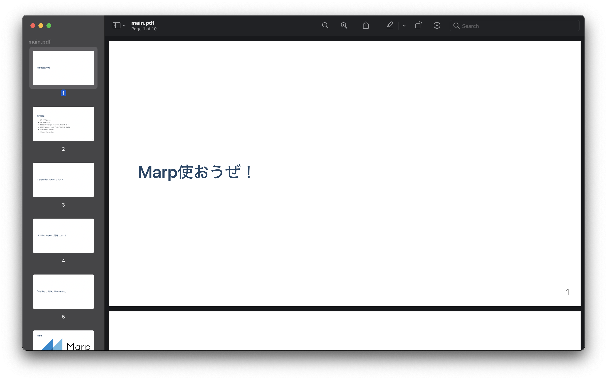
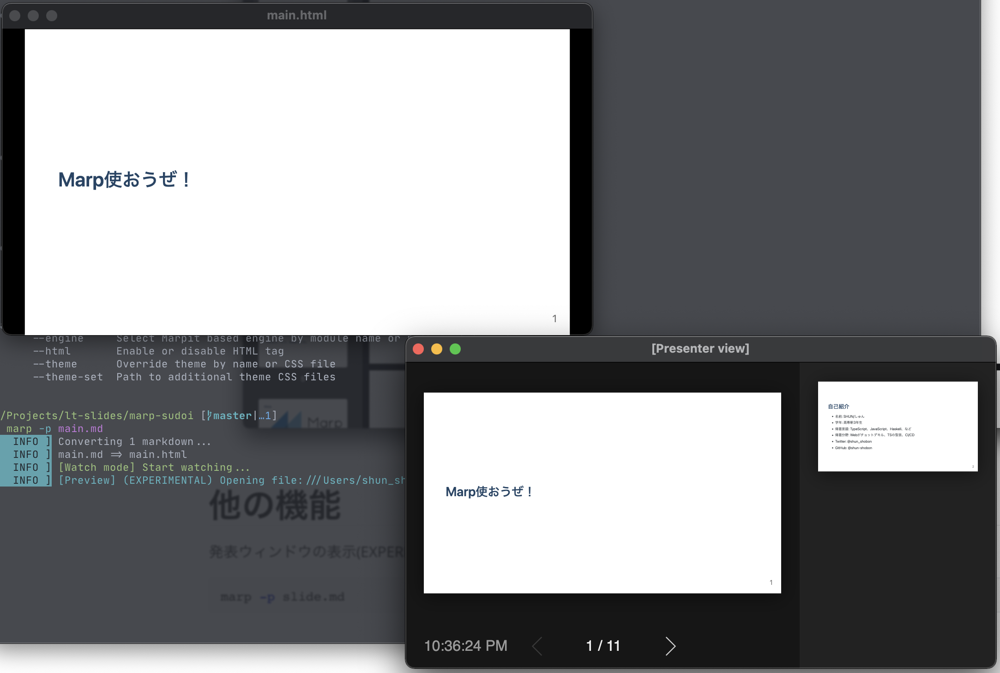

# Marp使おうぜ！


# 自己紹介

- 名前: SHUN/しゅん
- 学年: 高専新3年生
- 得意言語: TypeScript、JavaScript、Haskell、など
- 得意分野: Webがチョットデキル、TSの型芸、CI/CD
- Twitter: @shun_shobon
- GitHub: @shun-shobon


# こう思ったことないですか？


# LTスライドもGitで管理したい！


# ｢できるよ｣


# ｢そう、Marpならね｣


# Marp


開発者が大好きなMarkdownでプレゼンスライドを作ることができる

作ったスライドはHTML、PDF等に出力可能


# 書き方

Markdownの戦闘にこんなのを書く

```md
---
theme: default
paginate: true
headingDivider: 1
---
```


# 書き方

普通にMarkdownを書く

h1ヘッダー or ページ区切り`---`を使うとページが変わります

```md
# 1枚目のスライド

## ここもまだ1枚目

# 2枚目のスライド

---

## 3枚目のスライド
```


# スライドを作る

npmからmarpのCLIツールを入れる

```shell
$ npm install -g @marp-team/marp-cli
```


# スライドを作る

コマンドを叩く

```shell
$ marp --pdf slide.md
```

`slide.pdf`が生成されます


---




# 他の機能

発表ウィンドウの表示(EXPERIMENTALです)

```shell
marp -p slide.md
```


---





# 他の機能

- 独自テーマ
- カスタムCSS
- 画像の大きさ指定
- 画像フィルター


# まとめ


# Marp使おうぜ！

