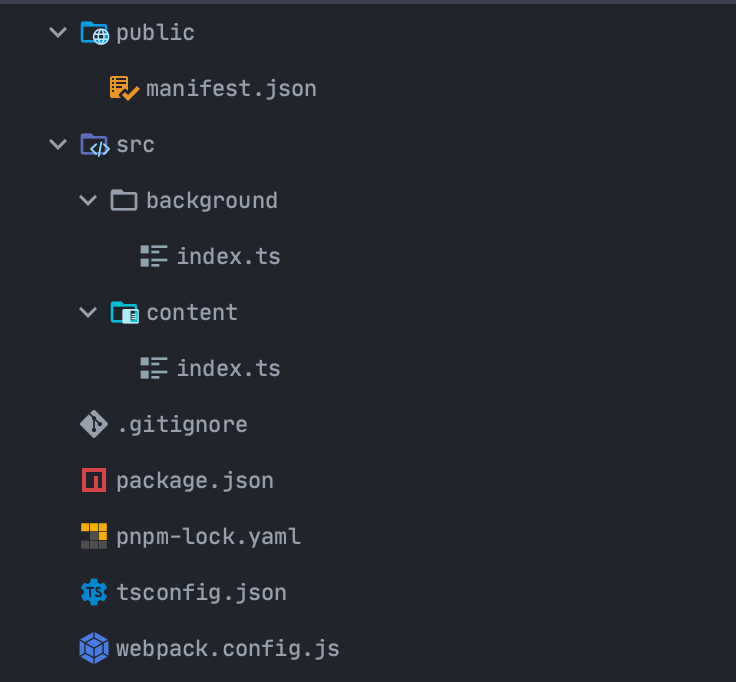

# TSでChrome拡張機能


# 自己紹介

- SHUN/しゅん
- 長野高専2年生
- 好きな言語: TypeScript / Haskell
- 好きな技術: Web系、純粋関数型、型芸、CI / CD
- Twitter: @shun_shobon
- GitHub: @shun-shobon


# 話すこと


# TypeScriptでChrome拡張機能を書きたい！


# やり方の概要

- npm initする
- TypeScriptを入れる
- Webpackを入れる
- Copy Webpack Pluginを入れる
- Chrome拡張用の型定義を入れる
- おわり


# npm initする

コマンドを叩くだけ

```shell
# お好きなパッケージマネージャを選んでね
$ npm init
$ yarn init
$ pnpm init
```


# TypeScriptを入れる

TypeScriptを入れて、`tsconfig.json`を追加する

```shell
$ pnpm i -D typescript
```

---

`tsconfig.json`

```json
{
  "compilerOptions": {
    "target": "esnext",
    "module": "esnext"
  }
}
```


# Webpackを入れる

`webpack`、`webpack-cli`、`ts-loader`を入れて、`webpack.config.js`を追加する

```shell
$ pnpm i -D webpack webpack-cli ts-loader
```

---

`webpack.config.js`

```javascript
const path = require("path");

module.exports = {
  entry: {
    ["background/index"]: path.resolve("src", "background", "index.ts"),
    ["content/index"]: path.resolve("src", "content", "index.ts"),
  },
  output: {
    path: path.resolve("dist"),
    publicPath: "/",
    filename: "[name].js",
  },
  resolve: {
    extensions: [".ts", ".js"],
  },
  module: {
    rules: [
      {
        test: /\.tsx?/,
        exclude: /node_modules/,
        loader: "ts-loader",
      },
    ],
  },
};
```


# Copy Webpack Pluginを入れる

任意のファイルを出力ディレクトリにコピーしてくれるやつ(`manifest.json`のコピーに必須)

```shell
$ pnpm i -D copy-webpack-plugin
```

`webpack.config.js`

```javascript
const CopyWebpackPlugin = require("copy-webpack-plugin");

module.exports = {
  plugins: [
    new CopyWebpackPlugin({
      patterns: [
        {
          from: path.resolve("public"),
        },
      ],
    }),
  ],
};
```


# Chrome用の型定義

`@types/chrome`っていうのがある

```shell
$ pnpm i -D @types/chrome
```


# 完成


# 使い方




# これで作ったもの

[](https://github.com/shun-shobon/picture-in-picture-extension)

---


# 終わり