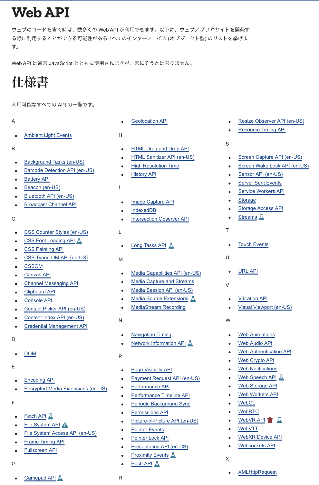

# Web APIすげえ！！

# 自己紹介

- 名前: SHUN/しゅん
- 学年: 3学年
- 言語: JavaScript / TypeScript / Haskell
- 分野: フロントエンド / CI/CD / 最適化
- 最近の出来事:
  - 誕生日を迎えた
  - 誕プレ待ってるよ
  - ***服はお腹いっぱいなので勘弁してください***

# あらゆるデバイスで動く言語

# あらゆるデバイスで動く言語

- Java
- Python
- Ruby
- などなど…

# あらゆるデバイスで動く言語

ランタイムのインストールが必須

# そこで

# JavaScriptという選択肢

# JavaScriptという選択肢

もちろんJSもランタイムのインストールが必須

# しかし

# JavaScriptはブラウザでも動作する

Windows、macOS、Linux、Android、iOS等のOSには必ずブラウザがプリインストールされている
→JavaScriptは事前準備なしにあらゆるデバイスで動作する唯一の言語！！！

# でも…

ブラウザは一種のサンドボックス環境

- ローカルへのファイルアクセスはごくごく限定的
- OSネイティブな機能はまず使用できない

# そこで

# Web API

# Web APIとは

- ウェブ(ブラウザ)で用いることのできるAPIの総称
- 様々なネイティブの機能がWeb APIを通して利用可能

# Web API

# ちょこっと紹介

# WebRTC

- ブラウザ上でPeer to Peerの通信が可能
- ビデオ通話･クライアント間のリアルタイム通信で使用

# WebXR API (旧WebVR)

- ブラウザ上でVR･ARが使える
- すごい(すごい)

# Bluetooth API

- ブラウザ上でBluetoothが使える
- すごい(すごい)

# 他にも

- IndexedDB: SQLベースのRDBMSっぽいデータベース
- Gamepad API: ゲームパッドが使える
- Web Notifications: プッシュ通知が使える
- Media Capture and Streams API: カメラや画面キャプチャが使える
- Web Authentication API: YubiKeyなどの認証器が使える
- Web Speech API: 合成音声発声･音声認識が使える

# まとめ

Web APIすげえ！！
